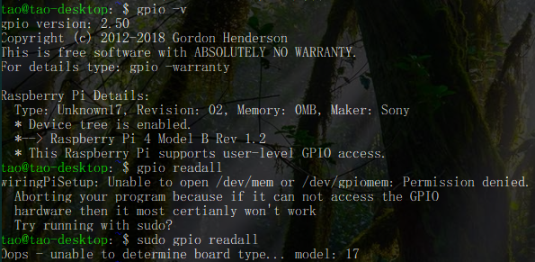

前段时间购入了一个树莓派 4B，最近打算研究下 GPIO ，因为只会 C++ 所以需要安装 WiringPi 来进行开发。

但是，在运行完下面代码后

```shell
sudo apt-get wiringpi
gpio -v
gpio readall
```

我却得到了下图的结果



---

在网上查找资料后才知道是 2.5.0 的 WiringPi 版本太低了，没有适配树莓派 4B，于是按照 Mr.Gordon 的[这篇文章](http://wiringpi.com/wiringpi-updated-to-2-52-for-the-raspberry-pi-4b/)安装 2.5.2 的 WiringPi


---

因为我安装的 64 位的 Ubuntu Mate，对应的架构是 arm 64，而这个包却是为 32 位系统编译的，对应的便是 armhf，无法安装 ╮（╯＿╰）╭

于是我又打算按 Mr.Gordon 的[安装教程](http://wiringpi.com/download-and-install/)来自己用源码 build

可是 `git clone git://git.drogon.net/wiringPi` 失败了，看到 Mr.Gordon 的[这篇文章](http://wiringpi.com/wiringpi-deprecated/)才又知道他已经弃坑啦，早知道我当时就安 32 位的系统了 QAQ

---

找遍了必应和谷歌，最后抱着试一试的心情去 Github 上居然找到了 WiringPi 源码的[仓库](https://github.com/WiringPi/WiringPi)

不过，最新的 Release 也是停留在 2.5.0 ，而看 commits 应该是已经更新到 2.6.0 了

有源码就好办了，抱着死马当活马医的心态我输入了以下代码

```shell
sudo apt-get purge wiringpi
hash -r
```

↑ 卸载旧的 WiringPi

```shell
git clone https://github.com/WiringPi/WiringPi.git
cd ./WiringPi
./build
```

↑ 安装新的 WiringPi

然后测试 `gpio -v` 和 `gpio readall`


似乎还是 2.6.0 的“豪华版”~得嘞！等书和硬件到了就能好好把玩 GPIO 了
